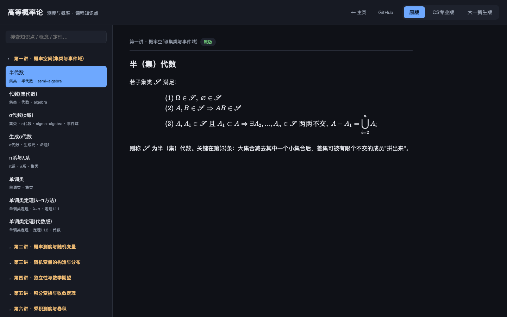

# Advanced Probability Theory · 高等概率论

记录本校高等概率论课程笔记，参考教材 [《测度与概率》（严加安）](https://book.douban.com/subject/1583463/)，先修课程为概率论，修过实变函数或者实分析更好。

本仓库在笔记基础上构建了一个**交互式学习网站**，把 15 讲、共 **117 个知识点**整理为可检索、可切换难度的形式。



## 在线访问

GitHub Pages：<https://cimeguy.github.io/Advanced-Probability-Theory/>

本地查看：直接用浏览器打开 `site/index.html` 即可（纯静态，无需服务器）。

> **关于访问速度**：站点为纯静态、所有资源（含 KaTeX 公式库）均同源内置，本地打开秒开。线上若在国内网络下首屏偏慢，是 `github.io` 主域被限速所致，与代码无关。

## 待优化项

- **国内访问加速**：`github.io` 在大陆网络下首屏约 4~5 秒（域名限速）。如需更快，可同步部署到对国内更友好的平台：
  - **Cloudflare Pages**（推荐）：免费、无需实名、连上 GitHub 后每次 push 自动部署，构建输出目录设为 `site` 即可。
  - **Gitee Pages**：国内服务器最快，但需实名认证，且免费版每次更新代码后要手动点「更新」、有内容审核。

## 三个版本

每个知识点提供三种难度版本，可在页面右上角一键切换：

| 版本 | 说明 |
| --- | --- |
| **原版** | 严格的定义、定理与证明，忠于教材原文 |
| **CS专业版** | 在原文**之上**叠加计算机视角的注解（如 ReLU、傅里叶变换、蒙特卡洛、L² 投影、转移矩阵等类比），并附 📝 例题框 |
| **大一新生版** | 在原文**之上**叠加符号扫盲、直觉解释、生活化例子，并附 📝 例题框 |

> **设计原则**：CS 版与新生版**完整保留原版内容，仅在其上追加注解**，绝不改写或删减原文。剥离所有注解行后与原版逐字一致（已通过脚本校验）。

## 功能特性

- **分章节折叠目录**：左侧 15 讲可展开/折叠，点击知识点查看内容
- **全文搜索**：按标题与标签实时过滤，自动展开命中章节
- **数学公式渲染**：基于 KaTeX，支持行内与独立公式
- **注解框 / 例题框**：💡 注解（蓝色）与 📝 分步例题（绿色，含编号步骤）

## 课程目录

| 讲次 | 主题 | 对应章节 | 知识点数 |
| --- | --- | --- | --- |
| 第一讲 | 概率空间（集类与事件域） | Chapter 1 | 8 |
| 第二讲 | 概率测度与随机变量 | Chapter 1~2 | 8 |
| 第三讲 | 随机变量的构造与分布 | Chapter 2 | 7 |
| 第四讲 | 独立性与数学期望 | Chapter 3~4 | 8 |
| 第五讲 | 积分变换与收敛定理 | Chapter 3 | 8 |
| 第六讲 | 乘积测度与卷积 | Chapter 4 | 9 |
| 第七讲 | Fubini 定理与无穷乘积测度 | Chapter 4 | 9 |
| 第八讲 | 符号测度与 Radon-Nikodym | Chapter 5 | 7 |
| 第九讲 | 条件期望（定义） | Chapter 5 | 8 |
| 第十讲 | 条件期望（性质） | Chapter 5 | 7 |
| 第十一讲 | 鞅与 Markov 过程 | — | 7 |
| 第十二讲 | 几乎处处收敛与依概率收敛 | Chapter 6 | 7 |
| 第十三讲 | Lr 收敛与依分布收敛 | Chapter 6 | 7 |
| 第十四讲 | 弱收敛、Helly 定理与大数定律 | Chapter 6~7 | 8 |
| 第十五讲 | 大数定律与特征函数、CLT | Chapter 7~8 | 9 |

## 目录结构

```
.
├── site/                       # 网站源码（唯一来源，直接部署）
│   ├── index.html
│   ├── assets/
│   │   ├── app.js              # 轻量 Markdown 渲染 + 导航 + 搜索
│   │   ├── style.css
│   │   └── img/screenshot.png  # 首页预览图
│   └── data/
│       ├── structure.js        # 课程骨架：讲次 → 知识点(id/title/tags)
│       ├── original.js         # 原版内容（window.V_original）
│       ├── cs.js               # CS专业版（window.V_cs）
│       └── freshman.js         # 大一新生版（window.V_freshman）
├── .github/workflows/deploy.yml  # 推送即自动部署到 GitHub Pages
├── skill/                      # 配套可检索技能与课程地图
└── md文件/                     # 原始讲义 Markdown（第一~十五讲）
```

三个版本的数据文件按知识点 `id`（如 `kp-7-3`）对齐；新增内容时三份需保持 `id` 一致。

## 部署（GitHub Pages · 自动）

已配置 GitHub Actions 工作流（`.github/workflows/deploy.yml`），**每次 push 改动 `site/` 会自动部署**，无需手动操作。

首次启用（仅一次）：
1. 仓库 **Settings → Pages**
2. **Source** 选 **GitHub Actions**

之后只需正常修改 `site/` 下文件并 `git push`，Actions 会自动构建并上线。可在仓库 **Actions** 标签查看部署状态。

更新首页预览图：
```bash
"/Applications/Google Chrome.app/Contents/MacOS/Google Chrome" \
  --headless=new --window-size=1440,900 --virtual-time-budget=8000 \
  --screenshot="site/assets/img/screenshot.png" \
  "file://$(pwd)/site/index.html"
```

